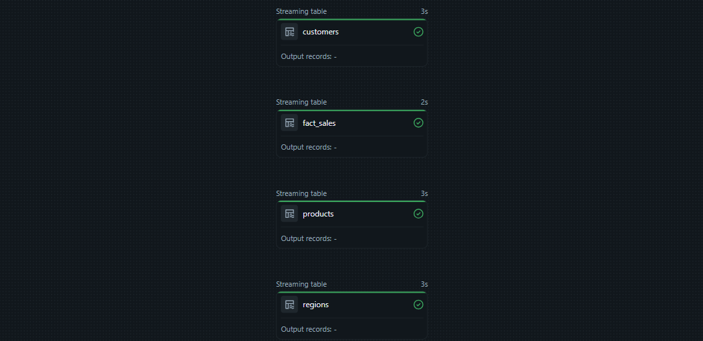
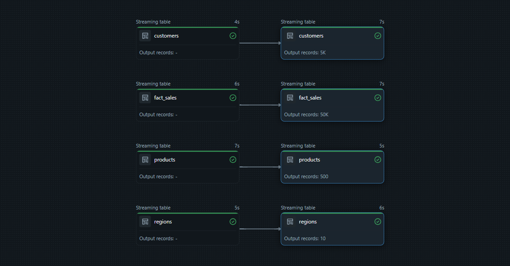
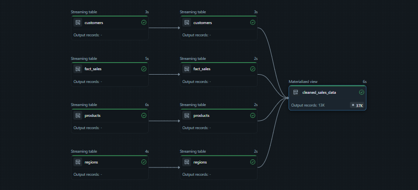
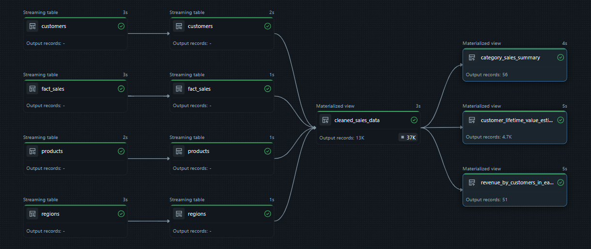

Automated Databricks Lakeflow Declarative Pipeline with Medallion Architecture and Autoloader

#  Automated Databricks Lakeflow Declarative Pipeline with Medallion Architecture and Autoloader

This project implements a full **Medallion Architecture pipeline** on Databricks using **Delta Live Tables (DLT)**. It ingests raw sales CSV files, cleans and standardizes them, joins dimensions, and produces Gold-level business KPIs using materialized views — ready for dashboards and analytics.

---

##  Architecture Overview


All tables use **Streaming Live Tables**, ensuring continuous freshness.

---

##  Pipeline Flow Visuals

**Landing → Bronze**  


**Bronze → Silver**  


**Silver → Cleaned Sales**  


**Cleaned → Gold**  


---

##  Layer Explanations (Short & Clear)

### **1) BRONZE — Raw Ingestion**
- Streams raw CSV files from Unity Catalog Volumes using `cloud_files()`
- No transformations; guarantees raw data recoverability
- Serves as replayable ingestion layer

**File:** `bronxe_transformation.sql`

---

### **2) SILVER — Data Cleaning & Standardization**
- Enforces schema using `CAST` and `TO_DATE`
- Normalizes datatypes for joins & analytics
- Removes ingestion noise

**File:** `silver_transformation.sql`

---

### **3) CLEANED SALES DATA (Materialized View)**
- Joins Fact + Customers + Products + Regions
- Adds derived metric `revenue = price * quantity`
- Uses `EXPECT ... DROP ROW` constraints to enforce quality

**File:** `cleaned_sales_data.sql`

---

### **4) GOLD — Business Aggregations**
Provides business-level analytical views:

| Gold MV Name | Metric Provided |
|--------------|-----------------|
| `category_sales_summary` | Category revenue by year |
| `revenue_by_customers_in_each_region` | Top 5 customers in each region |
| `Customer_Lifetime_Value_Estimation` | Lifetime revenue & avg spend |

**File:** `gold_transformations.sql`

---

##  Repository Structure

```bash
├── Dataset/
│   ├── customer.csv
│   ├── fact_sales.csv
│   ├── fact_sales2025.csv
│   ├── product.csv
│   └── region.csv
│
├── Fig/
│   ├── bronze_to_silver.png
│   ├── landing_zone_to_bronze.png
│   ├── silver_to_cleaned_sales_data.png
│   └── silver_to_gold.png
│
├── Scripts/
│   ├── bronxe_transformation.sql
│   ├── cleaned_sales_data.sql
│   ├── gold_transformations.sql
│   └── silver_transformation.sql
│
└── README.md
```


---

##  How to Run on Databricks (DLT)

1. Upload SQL files into a Databricks Repo / Workspace folder  
2. Create a new **Delta Live Tables Pipeline**  
3. Set:
   - Pipeline Source = this folder
   - Target Schema = `lakeflow_dlt`
   - Mode = Triggered or Continuous
4. **Start Pipeline**  
   → Bronze → Silver → Cleaned → Gold built automatically

---

##  Output — Gold KPIs Ready for BI

These materialized views can be directly connected to Power BI, Tableau, Excel, or SQL endpoints.

- Category-wise revenue trends
- Region-wise top customers
- Customer lifetime profitability ranking

---

